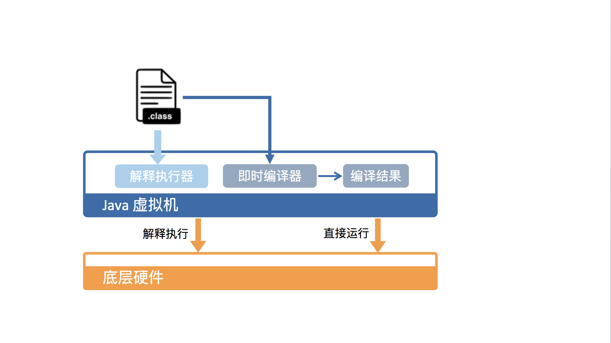

# 1 Java 代码是如何运行的
## 执行 Java 代码的不同方式

* 开发工具中执行 Java 代码
* 双击 jar 文件执行 Java 代码
* 命令行中执行 Java 代码
* 网页中执行 Java 代码

问题：不同执行 Java 代码的方式本质上有什么不同？

### JRE VS JDK

* JRE 仅包含运行 Java 程序的必需组件，包括 JVM 以及 Java 核心类库。
* JDK 除了包含 JRE 之外，还附带一系列开发、诊断工具。

### 字节码 VS 机器码

C++ 代码不需要运行时，C++ 代码直接编译成 CPU 能够执行的机器码。

Java 代码会被编译成字节码，之后 JVM 会对字节码解释执行，或者采用 JIT 技术。之所以被称为字节码指令，是因为字节码指令的操作码 **opcode** 被固定为一个字节。

### JVM 的好处

* JVM 对操作系统进行抽象，为字节码的运行提供了一个统一的环境。
* JVM 在统一环境的基础上进一步提供了一个托管环境（进一步表明，JVM 与一般 OS 的不同之处），能够代替我们处理一些代码中冗长且容易出错的部分，如自动内存管理与垃圾回收，数组越界、动态类型、安全权限等动态检测。

## JVM 是如何运行字节码的

### 从 JVM 视角看字节码的运行过程

类加载器会将字节码加载并存放于方法区 **Method Area**；实际运行时，JVM 会执行方法区内的代码。

JVM 将栈细分为面向 Java 方法的 Java 方法栈，面向本地方法的本地方法栈。本地方法指的是用 C++ 编写的 native 方法。栈帧的大小是提前计算好的，而且 Java 虚拟机不要求栈帧在内存空间是连续分布的。

### 从硬件视角看字节码的运行过程

从硬件视角看，Java 字节码指令时无法直接执行的。因此，JVM 需要将字节码指令翻译成机器码指令。在 HotSpot 中，上述翻译过程有两种形式。

* 解释执行：逐条将字节码翻译成机器码并执行。
* 即时编译：将一个方法中包含的字节码直接编译成机器码后再执行。

解释执行的优势在于无需等待编译，即时编译的优势在于实际运行速度更快。HotSpot 默认采用混合模式，综合了两者的优点。**HotSpot 会先解释执行字节码，然后将其中反复执行的热点代码，以方法为单位进行即时编译**。

### 多种即时编译器

理论上讲，即时编译后的 Java 程序的执行效率，是可能超过 C++ 程序的。这是因为与静态编译相比，即时编译拥有程序的运行时信息，并能够根据这些运行时信息做出相应的优化。

为了满足不同用户场景的需要，**在编译时间和生成代码的执行效率之间进行取舍**，HotSpot 内置了多个即时编译器：

* C1：Client 编译器
* C2：Server 编译器
* Graal：Java 10 正式引进的实验性即时编译器
